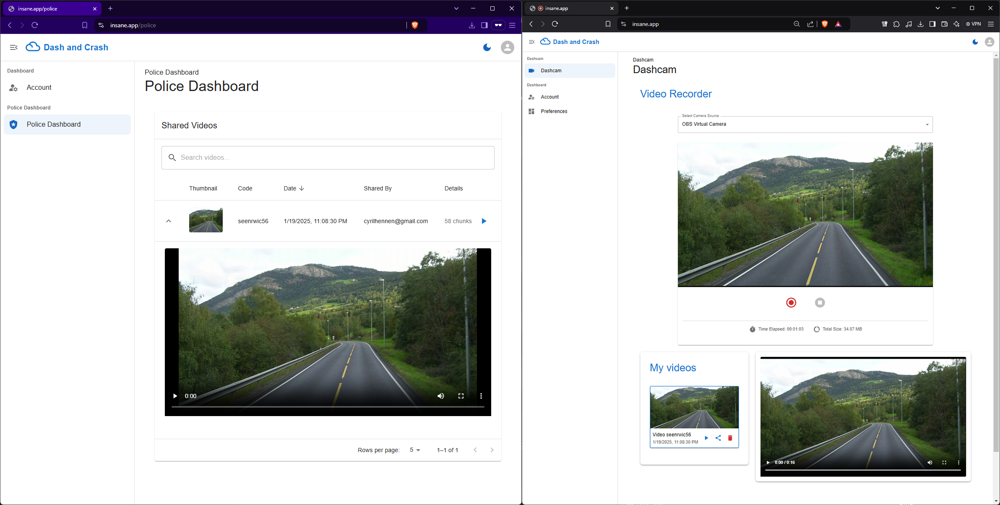

# INFO-Y115 Secure Software Design and Web Security: Dash And Crash

- **Authors:**
  - **Samir Azmar** `000503446`
  - **Marcus Chrétien** `000498327`
  - **Hennen Cyril** `000596621`
  - **Elric Deroeux** `000596621`
  - **Hugo Lefebvre** `000524628`
  - **Quentin Lévêque** `000595895`



Screenshot of our app: Trusted user interface with a video shared (left), standard dashcam user (Right)

## Production

- Live Production is available at [insane.app](https://insane.app)
- Distinct Log Server API available at [logs.insane.app](https://logs.insane.app) (accessible only from the main server)
- Distinct Mail Server API available at [mailer.insane.app](https://mailer.insane.app) (accessible only from the main server)

## Installation scripts

We provide scripts that install NodeJS and the necessary dependencies, create the keys and certificates and the databases.

1. Make sure to follow [Environment setup](#2-environment-variables) before following the next steps.
2. Execute `source install.sh`; It'll install NodeJS and create the keys and certificates.
3. Execute `./init.sh`; It'll install the dependencies and create the databases.
4. Enter **log-server**, **main**, and **mail-server** directories via the terminal and execute `npm run dev`. This will start the servers.

If the scrips doesn't work, follow the Installation guide. (`NOTE`: The development mode compiles the application as you move page to page so it might be slow thus leading to incorrect behavior. If somethings doesn't work, please try it at least 3 times.)

## Installation guide

There are 3 components in this project, which are present in 3 different folders in this repository:

- **log-server**: The logging API server
- **main**: The main dashboard, all in one front + back
- **mail-server**: The server that send email for verifying email address.

### 1. Installing NodeJS

NodeJS v23.5.0 (latest as of December 2024) required on the system:

From the original doc either nvm/fnm depending on what the system already has, if none is present on the system **we recommend fnm** [nodejs.org official download page](https://nodejs.org/en/download/package-manager)

```
# installs fnm (Fast Node Manager)
curl -fsSL https://fnm.vercel.app/install | bash

# activate fnm
source ~/.bashrc

# download and install Node.js
fnm use --install-if-missing 23

# verifies the right Node.js version is in the environment
node -v # should print `v23.5.0`

# verifies the right npm version is in the environment
npm -v # should print `10.9.2`
```

### 2. Environment variables

In the three components (**log-server**, **main**, and **mail-server**) there is a file named **.env.example**. This file helps the user to customize their environment variable with all the possible options "pre-filled".

**For security reason** the user has to **manually**, and we insist **MANUALLY** modify the file with their own settings and save the final in **.env** (the **.env.example** is ignored). The project **will not** run correctly without the proper **.env** file may result in undefined behavior.

### 3. Installing dependencies

**After manually setting up .env files in respective directories**:

For each of the three components (**log-server**, **main**, and **mail-server**) dependencies must be installed using `npm i` in their respective directories.

### 4. Setting up the database

The project uses Prisma ORM for the database. Which means To manipulate the database (initializing, migrations, ...) it will use the Prisma cli. This uses npx, which is bundled with NodeJS and npm.

To generate the database from the `prisma.schema`:

`npx prisma generate`

To create a migration named init (the first one):

`npx prisma migrate dev --name init`

### 5. Startup

To run the **log-server** or the **main** or **mail-server** app in development use the command `npm run dev`

`NOTE`: This project uses NextJS v15, with Prisma v6 ORM for database (using sqlite). The React runs on v18 (not the v19 due to dependencies compatibility issues). The project is entirely made in Typescript (except the server wrapper).

## Browsing the Database

Since both databases run on `sqlite`, it is possible to browse them using traditional `sqlite` browsers.

You can also use the Prisma web database browser:

`npx prisma studio`

Which will start on some port (usually 5555 if available) on localhost.

## Setting up the solution for production

To set the solution up for production we use the following script `deploy.js`. **This is not made to be run by the professor we provide it here to show our work**

What it does:
- Pull the source code from Gitlab using an authentication token
- Install dependencies and replace the .env files: it expects 3 files (.main.env .log.env .mail.env) located in same directory and it will then copy those .env files into the respective services.
- Puts the dkim.pem key for the mail-server

What it doesn't do:
- Setup the x.509 certificates for domain names.
- Setup the reverse proxy (**these services should never be exposed as-is to the internet**)

### Setting up nginx

#### Certificates

To setup certificates and **nginx** it's important to either have a domain (recommended) or generate a self-signed keypair.

Using a domain: `sudo certbot --nginx -d insane.app -d www.insane.app`

Self-signed:
```
mkdir -p /etc/nginx/self-signed
cd /etc/nginx/self-signed

# Generate a private key for the CA
openssl genrsa -out ca.key 2048

# Generate a self-signed CA certificate
openssl req -x509 -new -nodes -key ca.key -sha256 -days 3650 -out ca.pem \
    -subj "/C=US/ST=State/L=City/O=Organization/CN=My Test CA"

# Generate the Private Key for Your Server
openssl genrsa -out server.key 2048

# Create a Certificate Signing Request (CSR): The CSR contains the details of the server certificate
openssl req -new -key server.key -out server.csr \
    -subj "/C=US/ST=State/L=City/O=Organization/CN=insane.app"

# Sign the CSR with the CA: This step creates the server certificate signed by the CA
openssl x509 -req -in server.csr -CA ca.pem -CAkey ca.key -CAcreateserial \
    -out server.crt -days 365 -sha256

```

This will produce:

1. `server.key`: Your server's private key.
2. `server.crt`: Your server's certificate signed by your CA.
3. `ca.pem`: The CA's certificate.

Copy the certificates and key in the nginx directory:

```
cp server.key server.crt ca.pem /etc/nginx/self-signed/
```

Now in the insane.app.conf (replace with domain)

```
sudo nano /etc/nginx/conf.d/insane.app.conf
```

```
server {
    listen 443 ssl;
    server_name insane.app;
    http2 on;

    ssl_certificate /etc/nginx/self-signed/server.crt;
    ssl_certificate_key /etc/nginx/self-signed/server.key;

    ssl_client_certificate /etc/nginx/self-signed/ca.pem; # Optional if client cert auth is needed
    ssl_verify_client optional; # Optional, for client auth testing only

    ssl_protocols TLSv1.2 TLSv1.3;
    ssl_ciphers HIGH:!aNULL:!MD5;
    ssl_prefer_server_ciphers on;

    location / {
        proxy_pass http://127.0.0.1:39846; # Next.js app
        proxy_http_version 1.1; # Standard for compatibility, only used internally
        proxy_set_header Upgrade $http_upgrade;
        proxy_set_header Connection "upgrade";
        proxy_set_header Host $host;
        proxy_cache_bypass $http_upgrade;
        proxy_set_header X-Real-IP $remote_addr;
        proxy_set_header X-Forwarded-For $proxy_add_x_forwarded_for;
        proxy_set_header X-Forwarded-Proto $scheme;
    }

    error_page 500 502 503 504 /50x.html;
    location = /50x.html {
        root /usr/share/nginx/html;
    }
}
```

```
sudo nginx -t # Test the configuration
sudo systemctl restart nginx
```